

    <h1>AflFast</h1>
    

        This page shows the distribution of time-to-bug measurements for every bug reached and/or triggered by the
        fuzzer. The results are grouped by library to highlight any performance trends the fuzzer may have against
        specific targets.
    

    
        <h3>poppler</h3>
        

                
                    

                        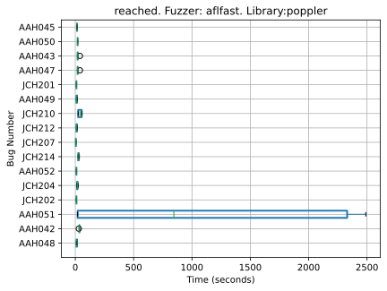
                    

                
                    

                        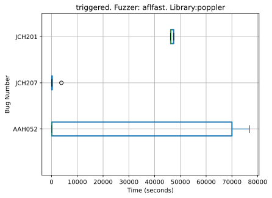
                    

                
        

    
        <h3>libpng</h3>
        

                
                    

                        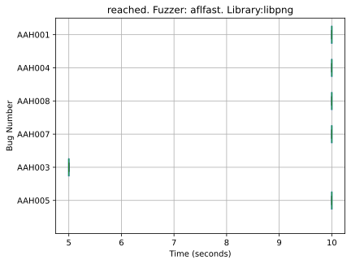
                    

                
                    

                        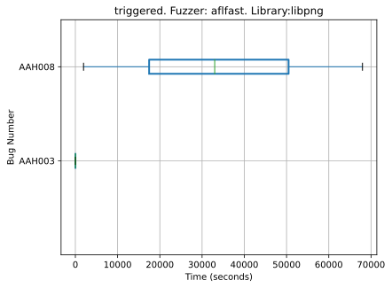
                    

                
        

    
        <h3>libtiff</h3>
        

                
                    

                        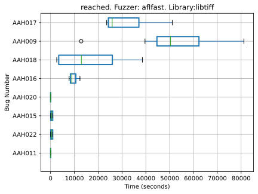
                    

                
                    

                        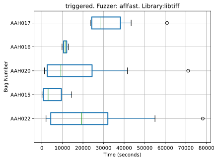
                    

                
        

    
        <h3>libxml2</h3>
        

                
                    

                        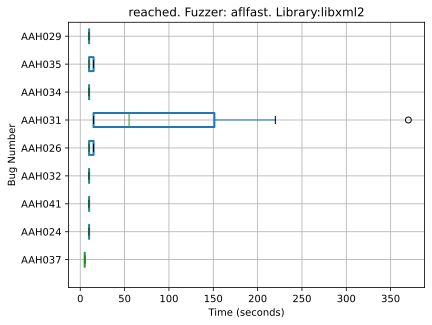
                    

                
                    

                        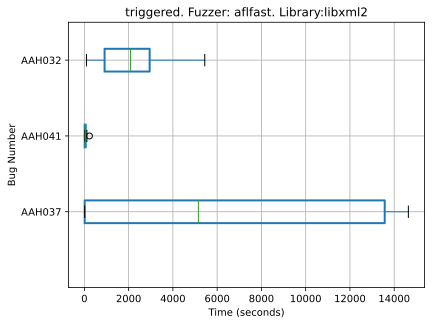
                    

                
        

    
        <h3>sqlite3</h3>
        

                
                    

                        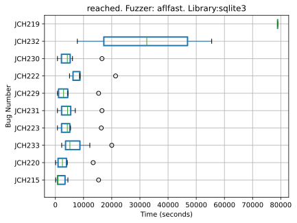
                    

                
                    

                        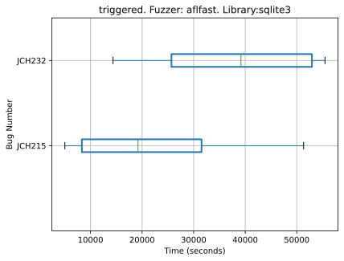
                    

                
        

    
        <h3>php</h3>
        

                
                    

                        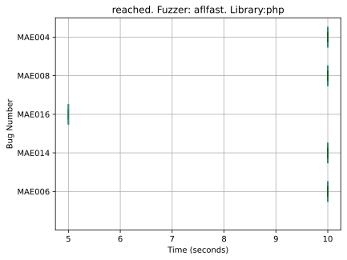
                    

                
                    

                        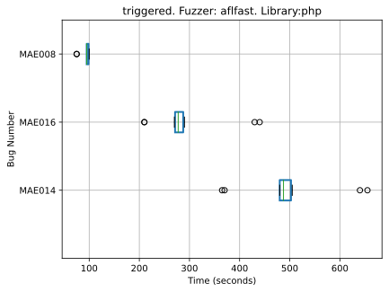
                    

                
        

    
        <h3>openssl</h3>
        

                
                    

                        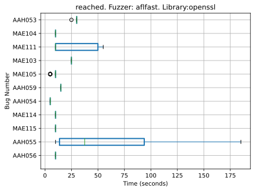
                    

                
                    

                        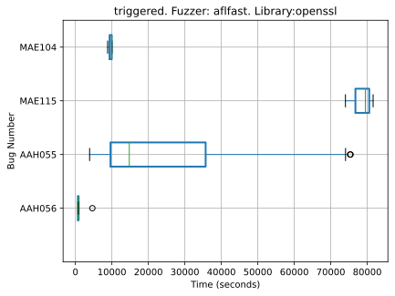
                    

                
        

    


{{ template | replace: '    ', ''}}
