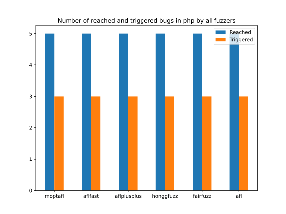



	<h1>Php</h1>
    

        This page displays the aggregate information about the library as collected from the evaluation.
    

    

    	

    		

				<i class="small material-icons">warning</i>
    		

    		

    			
    				This page is incomplete. In a future update, per-bug information will be added.
    			
    		

    	

    

    <h2>Total Bugs Reached and Triggered</h2>
	


{{ template | replace: '    ', ''}}
