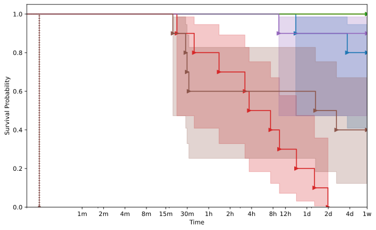
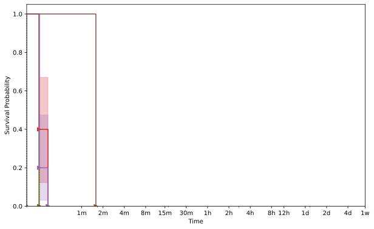
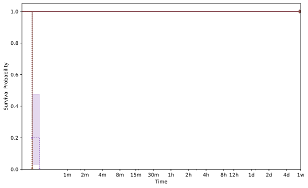
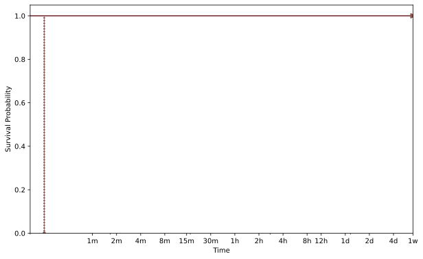
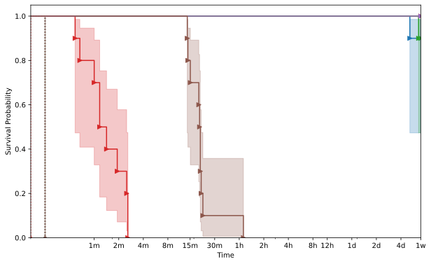
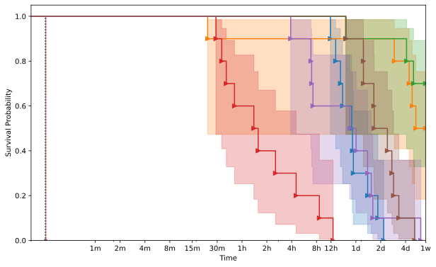



    <h1>libpng</h1>
    

        This page displays the aggregate information about the target as collected from the evaluation.
    

    

        

            
        

    

    
    <h2>libpng_read_fuzzer</h2>
    
        
    <h3>AAH001</h3>
    

        

            
        

    

    
        
    <h3>AAH003</h3>
    

        

            
        

    

    
        
    <h3>AAH004</h3>
    

        

            
        

    

    
        
    <h3>AAH005</h3>
    

        

            
        

    

    
        
    <h3>AAH007</h3>
    

        

            
        

    

    
        
    <h3>AAH008</h3>
    

        

            
        

    

    


{{ template | replace: '    ', ''}}
