

    <h1>libtiff</h1>
    

        This page displays the aggregate information about the target as collected from the evaluation.
    

    

        

            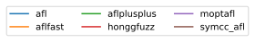
        

    

    
    <h2>tiff_read_rgba_fuzzer</h2>
    
        
    <h3>AAH009</h3>
    

        

            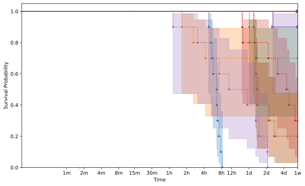
        

    

    
        
    <h3>AAH010</h3>
    

        

            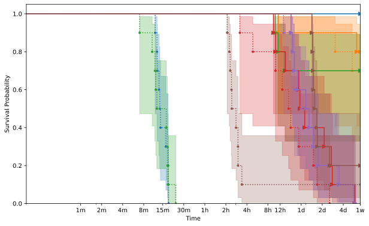
        

    

    
        
    <h3>AAH011</h3>
    

        

            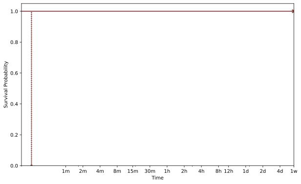
        

    

    
        
    <h3>AAH015</h3>
    

        

            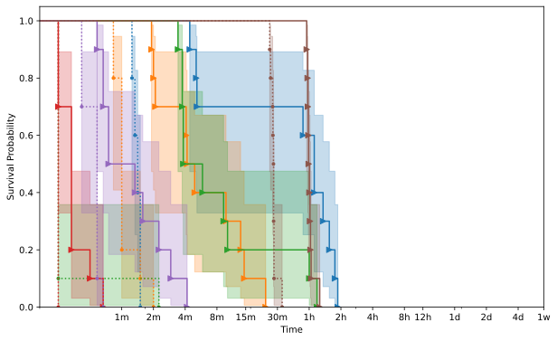
        

    

    
        
    <h3>AAH016</h3>
    

        

            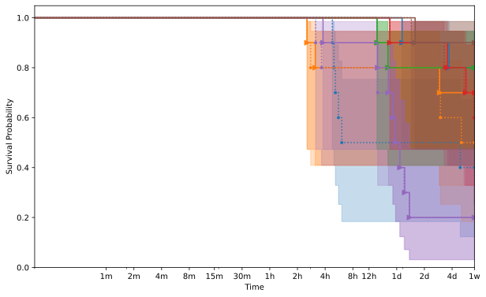
        

    

    
        
    <h3>AAH018</h3>
    

        

            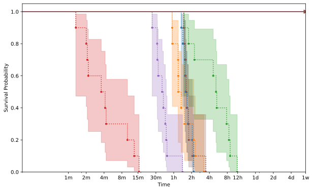
        

    

    
        
    <h3>AAH020</h3>
    

        

            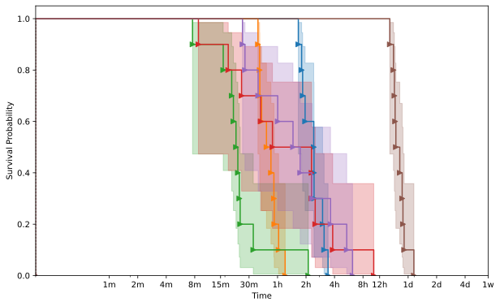
        

    

    
        
    <h3>AAH022</h3>
    

        

            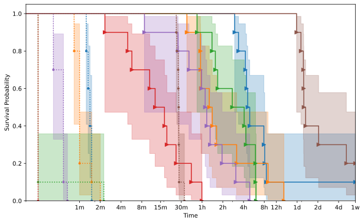
        

    

    

    
    <h2>tiffcp</h2>
    
        
    <h3>AAH009</h3>
    

        

            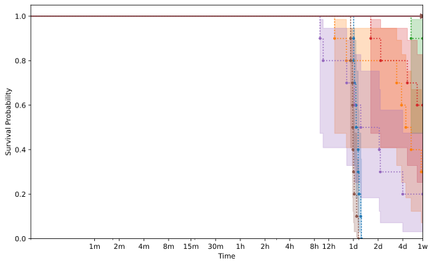
        

    

    
        
    <h3>AAH010</h3>
    

        

            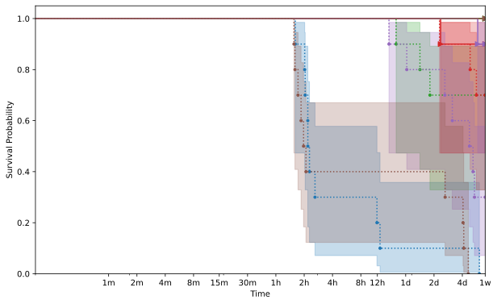
        

    

    
        
    <h3>AAH011</h3>
    

        

            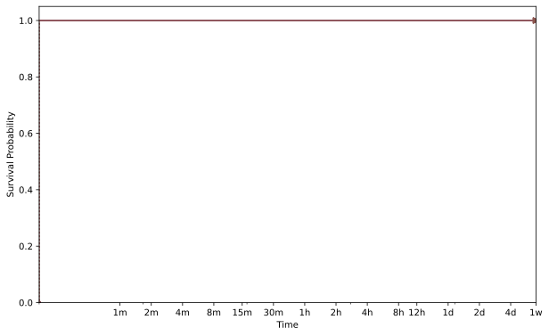
        

    

    
        
    <h3>AAH013</h3>
    

        

            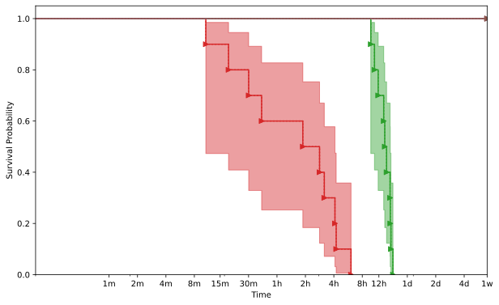
        

    

    
        
    <h3>AAH014</h3>
    

        

            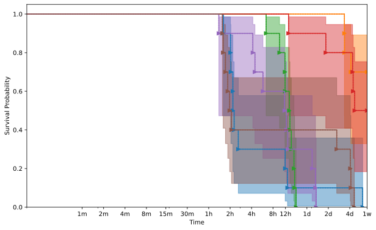
        

    

    
        
    <h3>AAH015</h3>
    

        

            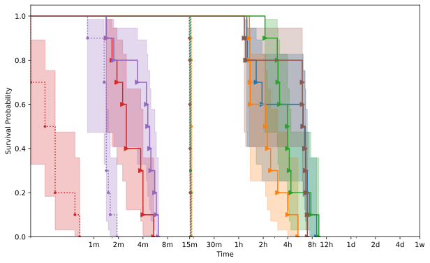
        

    

    
        
    <h3>AAH016</h3>
    

        

            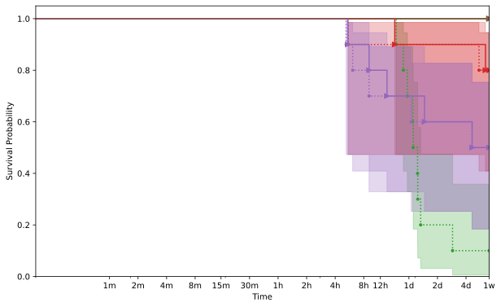
        

    

    
        
    <h3>AAH017</h3>
    

        

            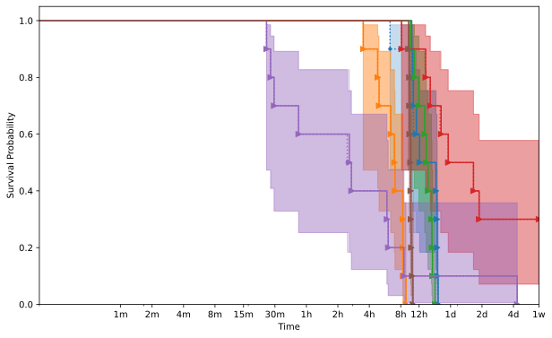
        

    

    
        
    <h3>AAH018</h3>
    

        

            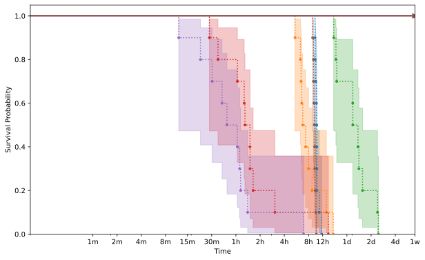
        

    

    
        
    <h3>AAH020</h3>
    

        

            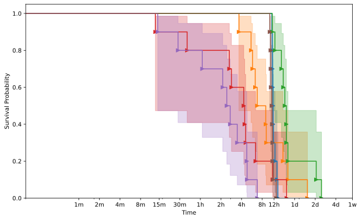
        

    

    
        
    <h3>AAH022</h3>
    

        

            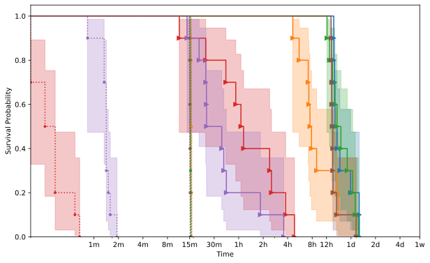
        

    

    


{{ template | replace: '    ', ''}}
