

    <h1>libxml2</h1>
    

        This page displays the aggregate information about the target as collected from the evaluation.
    

    

        

            
        

    

    
    <h2>libxml2_xml_read_memory_fuzzer</h2>
    
        
    <h3>AAH024</h3>
    

        

            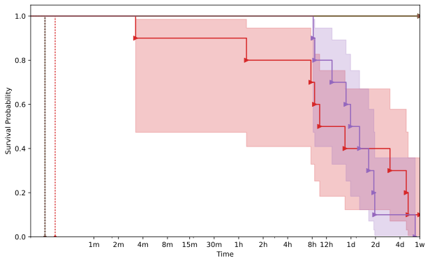
        

    

    
        
    <h3>AAH025</h3>
    

        

            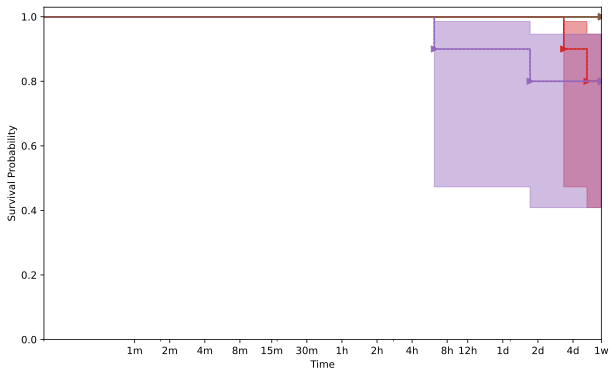
        

    

    
        
    <h3>AAH026</h3>
    

        

            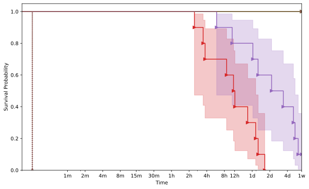
        

    

    
        
    <h3>AAH029</h3>
    

        

            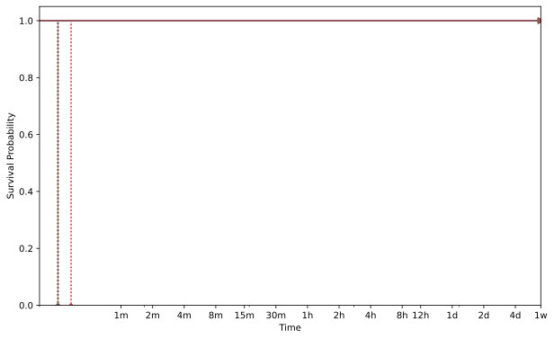
        

    

    
        
    <h3>AAH031</h3>
    

        

            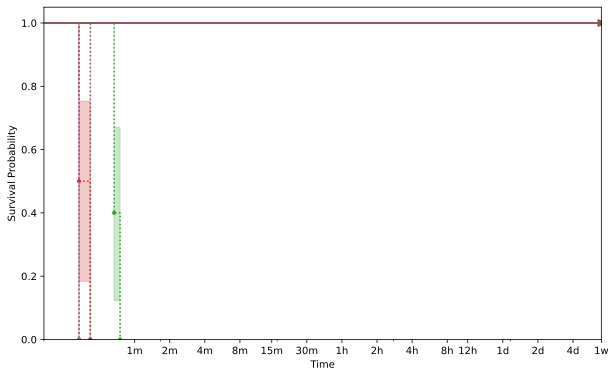
        

    

    
        
    <h3>AAH032</h3>
    

        

            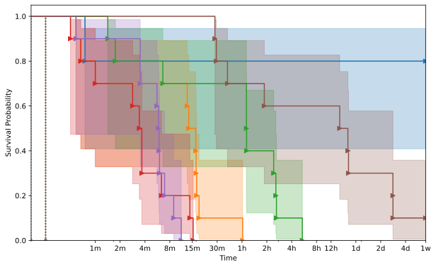
        

    

    
        
    <h3>AAH034</h3>
    

        

            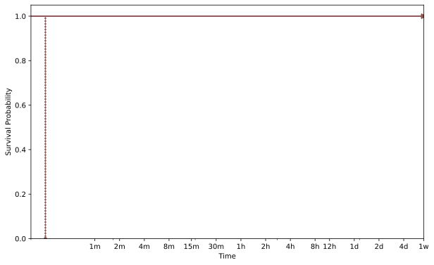
        

    

    
        
    <h3>AAH035</h3>
    

        

            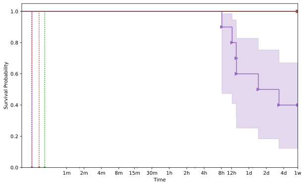
        

    

    
        
    <h3>AAH037</h3>
    

        

            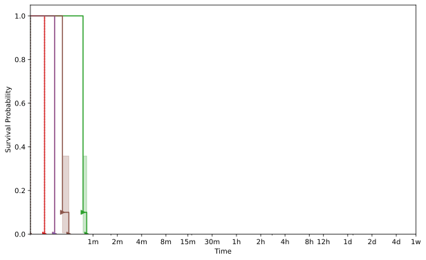
        

    

    
        
    <h3>AAH041</h3>
    

        

            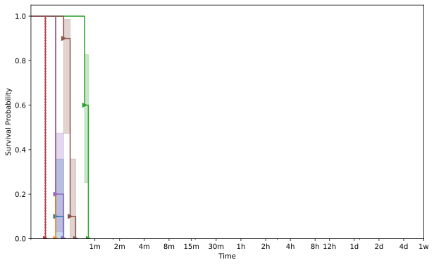
        

    

    

    
    <h2>xmllint</h2>
    
        
    <h3>AAH024</h3>
    

        

            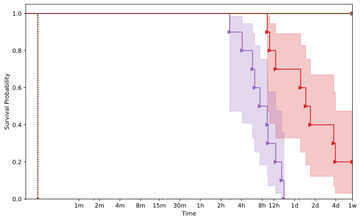
        

    

    
        
    <h3>AAH026</h3>
    

        

            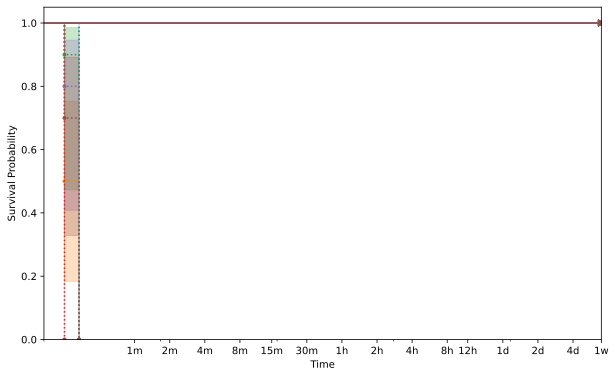
        

    

    
        
    <h3>AAH029</h3>
    

        

            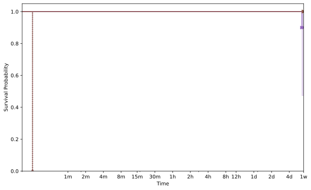
        

    

    
        
    <h3>AAH031</h3>
    

        

            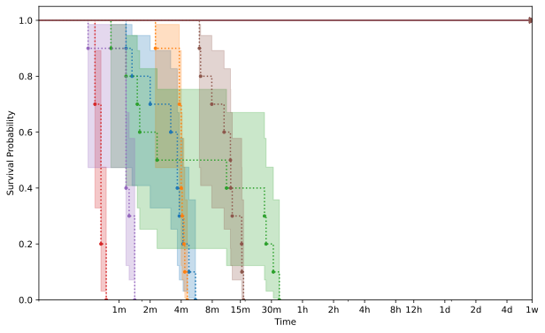
        

    

    
        
    <h3>AAH032</h3>
    

        

            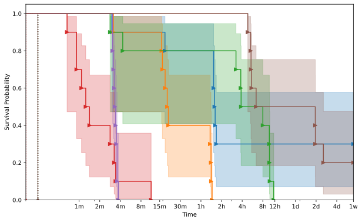
        

    

    
        
    <h3>AAH034</h3>
    

        

            
        

    

    
        
    <h3>AAH035</h3>
    

        

            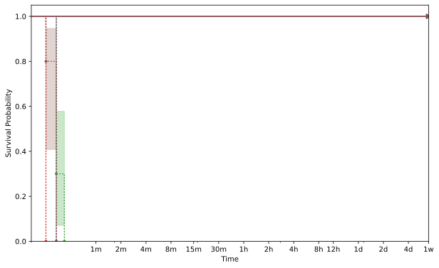
        

    

    
        
    <h3>AAH037</h3>
    

        

            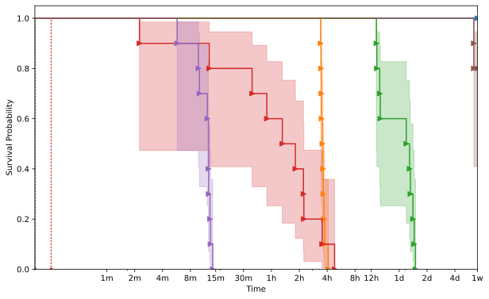
        

    

    
        
    <h3>AAH041</h3>
    

        

            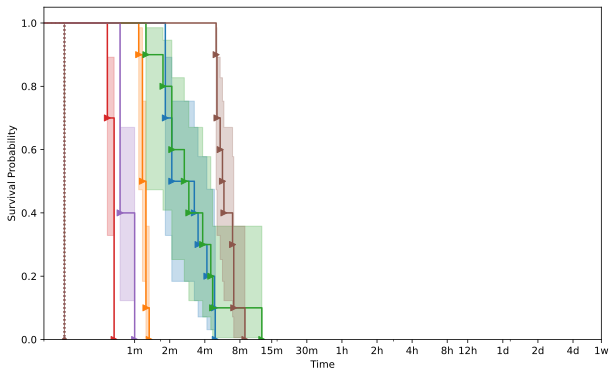
        

    

    


{{ template | replace: '    ', ''}}
