

    <h1>openssl</h1>
    

        This page displays the aggregate information about the target as collected from the evaluation.
    

    

        

            
        

    

    
    <h2>asn1</h2>
    
        
    <h3>AAH054</h3>
    

        

            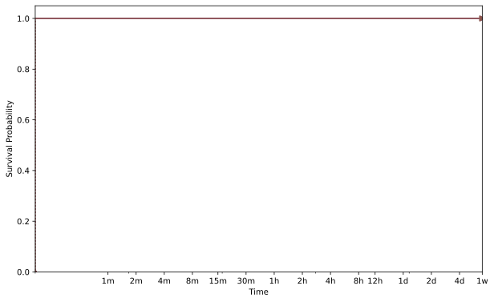
        

    

    
        
    <h3>AAH055</h3>
    

        

            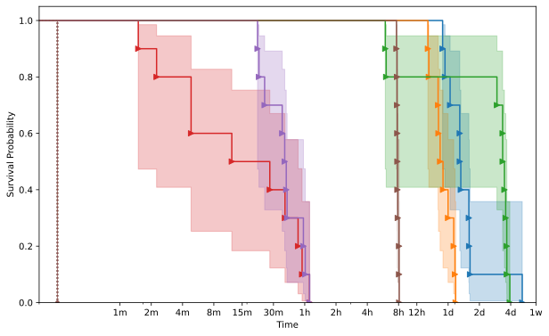
        

    

    
        
    <h3>MAE105</h3>
    

        

            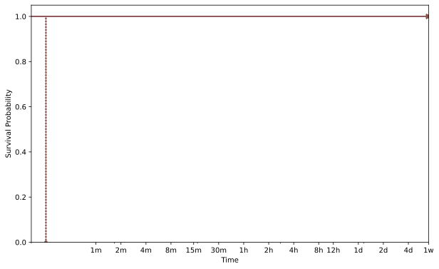
        

    

    
        
    <h3>MAE111</h3>
    

        

            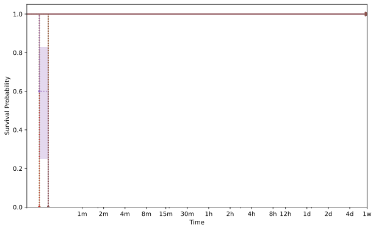
        

    

    

    
    <h2>asn1parse</h2>
    
        
    <h3>AAH054</h3>
    

        

            
        

    

    
        
    <h3>MAE105</h3>
    

        

            
        

    

    

    
    <h2>bignum</h2>
    
        
    <h3>MAE105</h3>
    

        

            
        

    

    

    
    <h2>client</h2>
    
        
    <h3>AAH054</h3>
    

        

            
        

    

    
        
    <h3>AAH055</h3>
    

        

            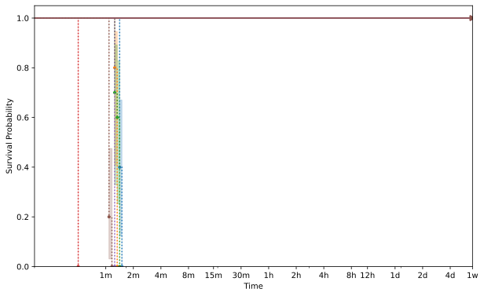
        

    

    
        
    <h3>AAH056</h3>
    

        

            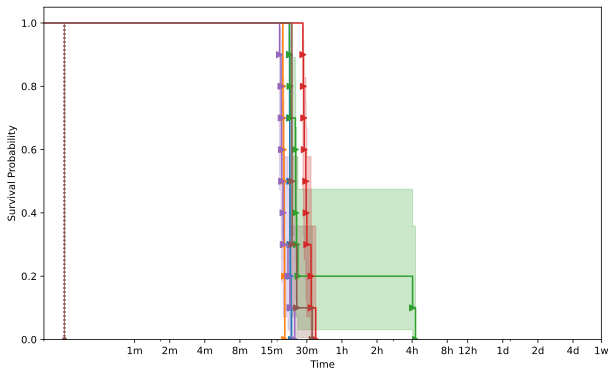
        

    

    
        
    <h3>MAE103</h3>
    

        

            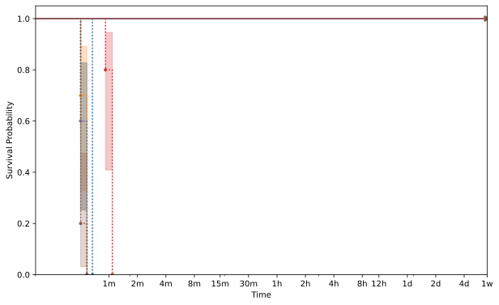
        

    

    
        
    <h3>MAE105</h3>
    

        

            
        

    

    
        
    <h3>MAE111</h3>
    

        

            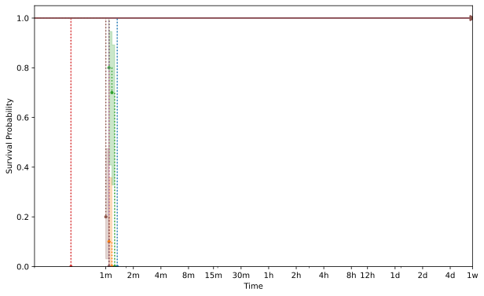
        

    

    
        
    <h3>MAE114</h3>
    

        

            
        

    

    

    
    <h2>server</h2>
    
        
    <h3>AAH054</h3>
    

        

            
        

    

    
        
    <h3>AAH055</h3>
    

        

            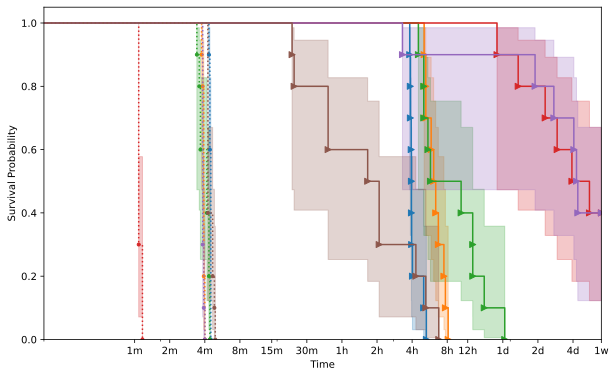
        

    

    
        
    <h3>AAH056</h3>
    

        

            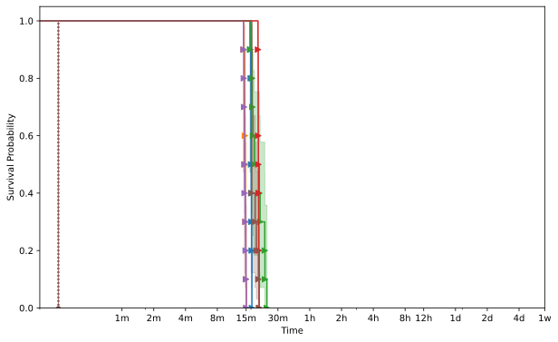
        

    

    
        
    <h3>AAH059</h3>
    

        

            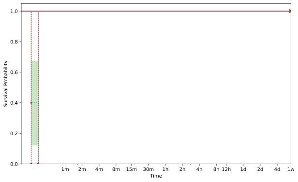
        

    

    
        
    <h3>MAE105</h3>
    

        

            
        

    

    
        
    <h3>MAE114</h3>
    

        

            
        

    

    
        
    <h3>MAE115</h3>
    

        

            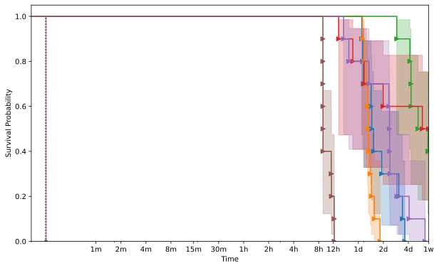
        

    

    

    
    <h2>x509</h2>
    
        
    <h3>AAH054</h3>
    

        

            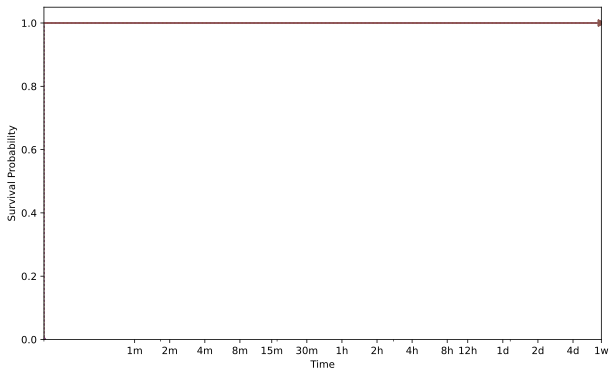
        

    

    
        
    <h3>AAH055</h3>
    

        

            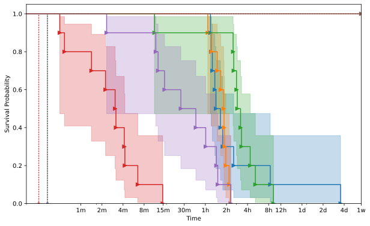
        

    

    
        
    <h3>MAE104</h3>
    

        

            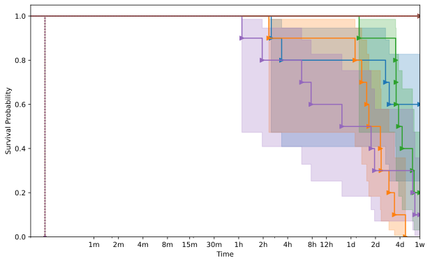
        

    

    
        
    <h3>MAE105</h3>
    

        

            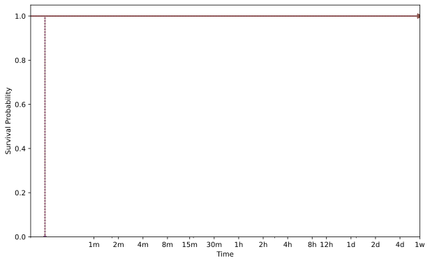
        

    

    
        
    <h3>MAE111</h3>
    

        

            
        

    

    


{{ template | replace: '    ', ''}}
