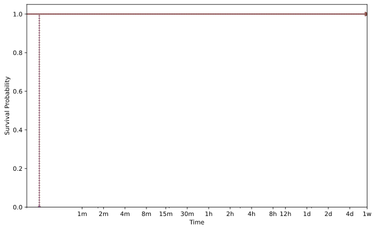
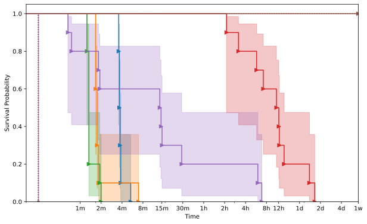
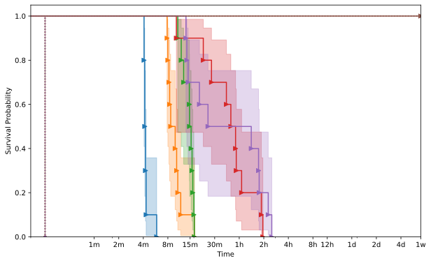
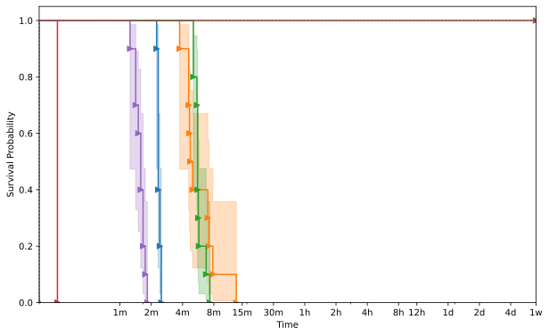



    <h1>php</h1>
    

        This page displays the aggregate information about the target as collected from the evaluation.
    

    

        

            
        

    

    
    <h2>exif</h2>
    
        
    <h3>MAE004</h3>
    

        

            
        

    

    
        
    <h3>MAE006</h3>
    

        

            
        

    

    
        
    <h3>MAE008</h3>
    

        

            
        

    

    
        
    <h3>MAE014</h3>
    

        

            
        

    

    
        
    <h3>MAE016</h3>
    

        

            
        

    

    


{{ template | replace: '    ', ''}}
