

    <h1>sqlite3</h1>
    

        This page displays the aggregate information about the target as collected from the evaluation.
    

    

        

            
        

    

    
    <h2>sqlite3_fuzz</h2>
    
        
    <h3>JCH215</h3>
    

        

            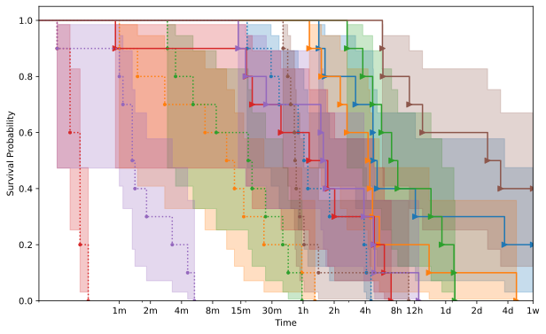
        

    

    
        
    <h3>JCH216</h3>
    

        

            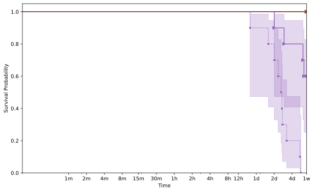
        

    

    
        
    <h3>JCH219</h3>
    

        

            
        

    

    
        
    <h3>JCH220</h3>
    

        

            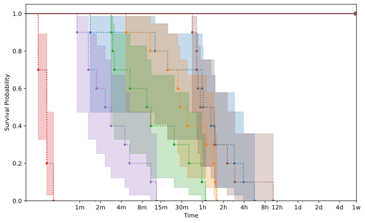
        

    

    
        
    <h3>JCH222</h3>
    

        

            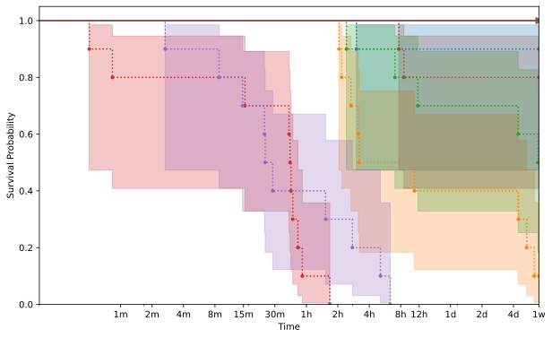
        

    

    
        
    <h3>JCH223</h3>
    

        

            
        

    

    
        
    <h3>JCH226</h3>
    

        

            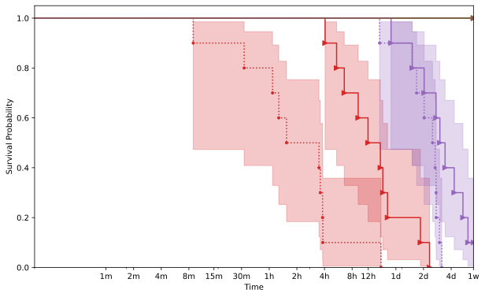
        

    

    
        
    <h3>JCH227</h3>
    

        

            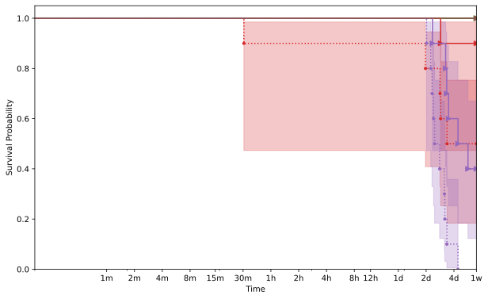
        

    

    
        
    <h3>JCH228</h3>
    

        

            
        

    

    
        
    <h3>JCH229</h3>
    

        

            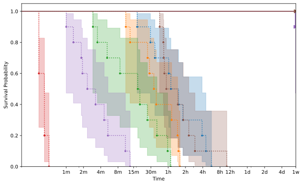
        

    

    
        
    <h3>JCH230</h3>
    

        

            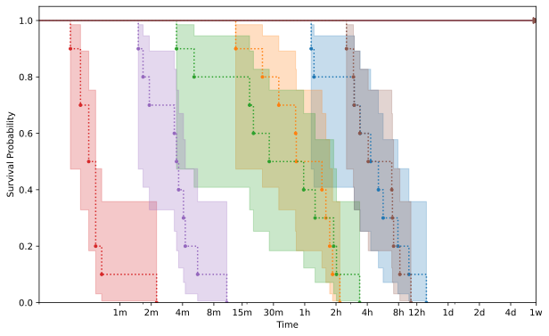
        

    

    
        
    <h3>JCH231</h3>
    

        

            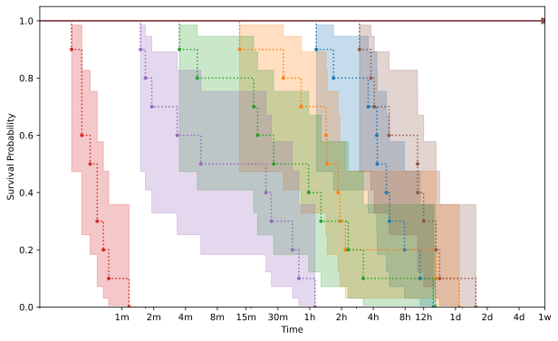
        

    

    
        
    <h3>JCH232</h3>
    

        

            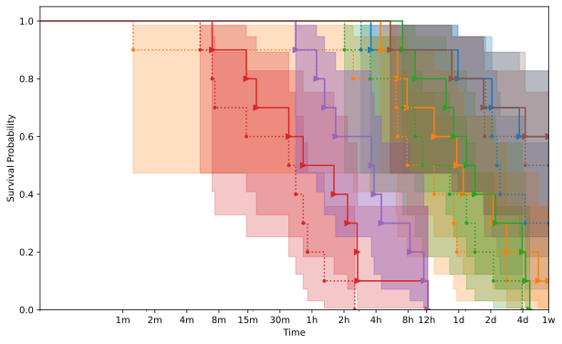
        

    

    
        
    <h3>JCH233</h3>
    

        

            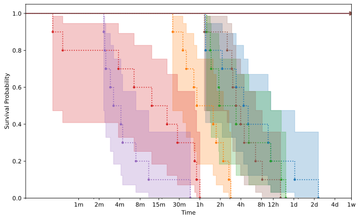
        

    

    


{{ template | replace: '    ', ''}}
